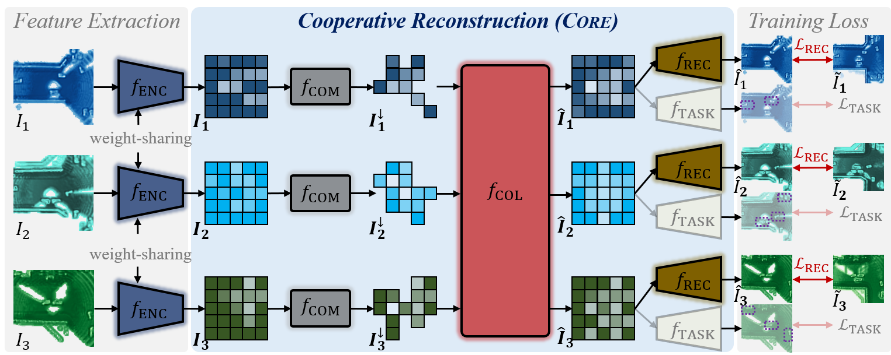

# CORE: Cooperative Reconstruction for Multi-Agent Perception

> [**CORE: Cooperative Reconstruction for Multi-Agent Perception**](https://arxiv.org/abs/2307.11514),            
> Binglu Wang, Lei Zhang, Zhaozhong Wang, Yongqiang Zhao, and [Tianfei Zhou](https://www.tfzhou.com/)  
> *ICCV 2023 ([arXiv 2307.11514](https://arxiv.org/abs/2307.11514))*

## Abstract

This paper presents CORE, a conceptually simple, effective and communication-efficient model for multi-agent cooperative perception.  It addresses the task from a novel perspective of cooperative reconstruction, based on two key insights: 1) cooperating agents together provide a more holistic observation of the environment, and 2) the holistic observation can serve as valuable supervision to explicitly guide the model  learning how to reconstruct the ideal observation based on collaboration.  CORE instantiates the idea with three major components: a compressor for each agent to create more compact feature representation for  efficient broadcasting, a lightweight attentive collaboration component for cross-agent message aggregation, and a reconstruction module to  reconstruct the observation based on aggregated feature representations. This learning-to-reconstruct idea is task-agnostic, and offers clear and reasonable supervision to inspire more effective collaboration, eventually  promoting perception tasks. We validate CORE on OPV2V, a large-scale multi-agent percetion dataset, in  two tasks, i.e., 3D object detection and semantic segmentation. Results demonstrate that CORE achieves state-of-the-art performance, and is more communication-efficient.
